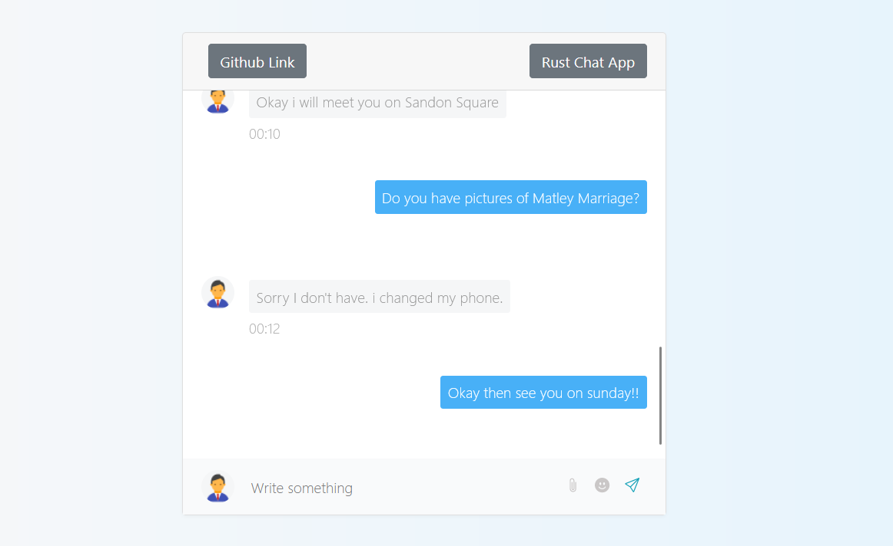

#  Rust Chat App

[](https://github.com/mrnazu/chat-app)  [](https://github.com/mrnazu/chat-app)  [](https://github.com/mrnazu/chat-app)


A blazing-fast and secure chat application built with Rust, offering real-time communication for everyone. 

[](https://github.com/mrnazu/chat-app)


## ⭐️ Features

- **Real-time chat:** Connect with friends and colleagues instantly with low-latency communication.
- **Secure communication:** Enjoy peace of mind knowing your conversations are protected (consider mentioning encryption methods if applicable).
- **Cross-platform support** (if applicable): Access your chats from any device, seamlessly.
- **Modular architecture:** Built with a modular design for easy extension and customization.
- **Scalable:** Designed to handle large numbers of users without performance bottlenecks.


## ️ Technology Stack

- **Rust:** A blazing-fast and memory-safe systems programming language for building robust backends.
- **Frontend:** Simple and easy Bootstrap for a smooth and responsive user interface.

##  Getting Started

1. **Prerequisites:**
    - Ensure you have Rust and Cargo installed on your system. Refer to the official Rust installation guide: https://www.rust-lang.org/tools/install
2. **Clone the repository:**
    ```bash
    git clone https://github.com/mrnazu/chat-app.git
    ```
3. **Navigate to the project directory:**
    ```bash
    cd chat-app
    ```
4. **Install dependencies on each workspace:**
    ```bash
    cargo install --path .
    ```
    or
    ```bash
    cargo build
    ```
5. **Run the application:**
    ```bash
    cargo run
    ```

##  Workspaces

This project utilizes Rust workspaces to organize code into manageable units:

- `backend`: Houses the core logic for handling user interactions, message processing, and database operations.
- `frontend`: Responsible for the user interface, rendering chat messages, and managing user input.
- `utils`: Contains shared utility functions used across the application.

##  Contributing

We appreciate your interest in contributing to this project! Please refer to the `CONTRIBUTING.md` file for details on how to submit pull requests, code style guidelines, and testing procedures.


## ⚖️ License

This project is licensed under the [MIT License](https://opensource.org/licenses/MIT).